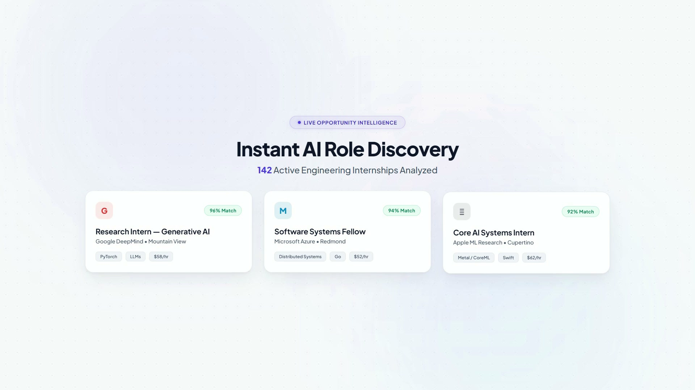
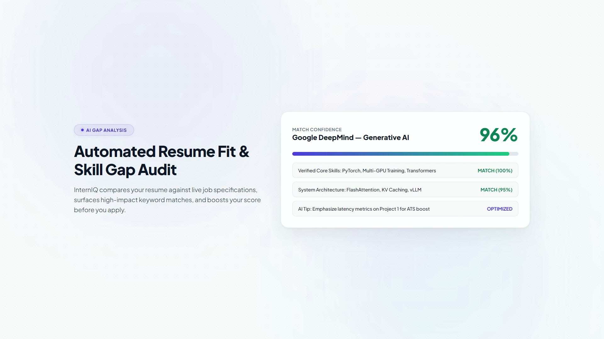
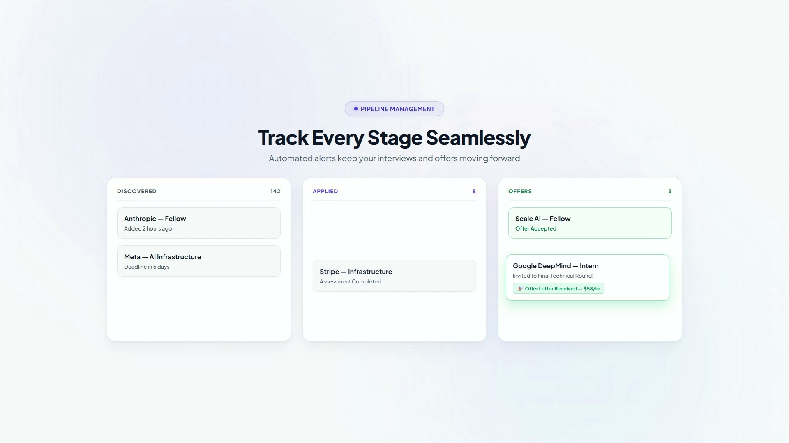
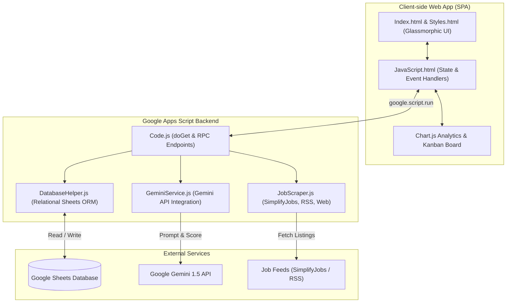

# Internship Intelligence Platform

An intelligent, full-stack internship aggregator, AI evaluation engine, and application tracker built on **Google Apps Script**, powered by **Google Gemini AI**, and utilizing **Google Sheets** as a serverless relational database.


---

<div align="center">
  <h3>🎬 Product Launch Showcase</h3>
  <a href="https://github.com/DhruvBasia/internship-intelligence-platform/releases/download/v1.0.0/interniq-launch-30s-optimized.mp4">
    
  </a>
  <p>
    🍿 <i>Auto-playing launch demonstration above.</i><br />
    🎬 <b><a href="https://github.com/DhruvBasia/internship-intelligence-platform/releases/download/v1.0.0/interniq-launch-30s-optimized.mp4">▶ Play / Download Full 1080p HD Video with Audio (MP4)</a></b> &nbsp;|&nbsp; 📦 <b><a href="https://github.com/DhruvBasia/internship-intelligence-platform/releases/tag/v1.0.0">Release v1.0.0</a></b>
  </p>
</div>

<br />

### ⚡ Feature Highlights

| 🔍 **Live Discovery & Ingestion** | 🎯 **Gemini Fit Scoring** | 📋 **Interactive Kanban Pipeline** |
| :---: | :---: | :---: |
|  |  |  |
| *Automated multi-feed scraping & deduplication* | *AI resume match analysis & interview tips* | *Visual stage management & status tracking* |

---

## Overview

The **Internship Intelligence Platform** helps students and early-career developers discover, prioritize, and manage internship opportunities. It automatically aggregates job listings from top sources, uses **Google Gemini AI** to score the candidate-job fit based on the user's custom profile and skills, and provides a modern, glassmorphic Single Page Application (SPA) with an interactive **Kanban Board** and **Analytics Dashboard**.

---

## Key Features

- **Gemini AI Match & Scoring**:
  - Automatically assesses job descriptions and requirements against your target roles, skills, and background.
  - Computes an objective match percentage and generates concise AI rationales and interview preparation tips.
- **Automated Multi-Source Job Scraper**:
  - Aggregates listings from **SimplifyJobs** (Summer tech internships), **AI-Jobs.net** RSS feed, and **Hacker News Jobs** RSS.
  - Deduplicates records and tags entries automatically.
- **Interactive Kanban Pipeline**:
  - Visual stage management: *Discovered*, *Applied*, *Interviewing*, *Offer*, *Rejected*, and *Archived*.
  - Update application stages and statuses seamlessly with instant database persistence.
- **Analytics & Insights Dashboard**:
  - Real-time Chart.js visualizations showing application progress, conversion funnels, and match score distributions.
- **Zero-Cost Serverless Backend**:
  - Uses **Google Sheets** as a free, scalable, relational database with dedicated sheets for Jobs, User Profile, Applications, and Activity Logs.
- **Privacy & Security First**:
  - Sensitive API keys are stored in `PropertiesService.getUserProperties()` and masked (`********************`) before reaching the client.

---

## Architecture



---

## Project Structure

```
├── Code.js              # Apps Script entry point, routing, and RPC endpoints
├── DatabaseHelper.js    # Google Sheets database ORM (CRUD, schema migration, logging)
├── GeminiService.js     # Google Gemini API client (match scoring, fit rationale)
├── JobScraper.js        # Multi-source scraper (SimplifyJobs JSON, RSS feeds)
├── Index.html           # Main HTML Single Page Application layout
├── JavaScript.html      # Frontend state management, UI events, Chart.js logic
├── Styles.html          # Glassmorphic CSS styling, responsive layout, animations
├── .gitignore           # Git ignore rules
└── README.md            # Project documentation
```

---

## Getting Started & Deployment

### 1. Create a Google Apps Script Project
1. Go to [script.google.com](https://script.google.com/) and click **New Project**.
2. Name your project (e.g., `Internship Intelligence Platform`).

### 2. Copy Code Files
Copy the contents of each file from this repository into your Apps Script project:
- Add script files (`.gs`): `Code.js`, `DatabaseHelper.js`, `GeminiService.js`, `JobScraper.js`
- Add HTML files: `Index.html`, `JavaScript.html`, `Styles.html`

*(Alternatively, deploy directly using Google's [clasp](https://github.com/google/clasp) CLI tool).*

### 3. Configure Google Gemini API Key
1. Obtain a free API key from [Google AI Studio](https://aistudio.google.com/).
2. In Google Apps Script, go to **Project Settings** (gear icon) > **Script Properties**.
3. Add a property:
   - **Property**: `GEMINI_API_KEY`
   - **Value**: *Your Gemini API key*
4. *(Optional)*: You can also configure or update your key directly inside the web app under **Settings**.

### 4. Deploy as a Web Application
1. Click **Deploy** > **New deployment**.
2. Select type: **Web app**.
3. Configuration:
   - **Description**: `Internship Intelligence Platform v1`
   - **Execute as**: `Me`
   - **Who has access**: `Only myself` (or as desired)
4. Click **Deploy** and open the generated Web App URL.
5. On the first launch, authorize the required Google permissions. The app will automatically initialize a dedicated Google Sheet database in your Google Drive and seed sample roles!

---

## Usage

1. **Dashboard**: View your top metrics, target role alignment, and weekly activity.
2. **Discovery Hub**: Browse aggregated internship postings, trigger new scrapers, or add custom roles manually.
3. **Run AI Match**: Click on any job to trigger Gemini's AI analysis for match percentage, strengths, skill gaps, and interview prep suggestions.
4. **Kanban Board**: Drag and drop or transition jobs across pipeline stages (*Applied*, *Interview*, *Offer*).
5. **Settings**: Customize your target roles, skills, graduation year, and preferred locations.

---

## Author

**Dhruv Basia**
- GitHub: [@DhruvBasia](https://github.com/DhruvBasia)

---

## License

This project is licensed under the [MIT License](LICENSE).
